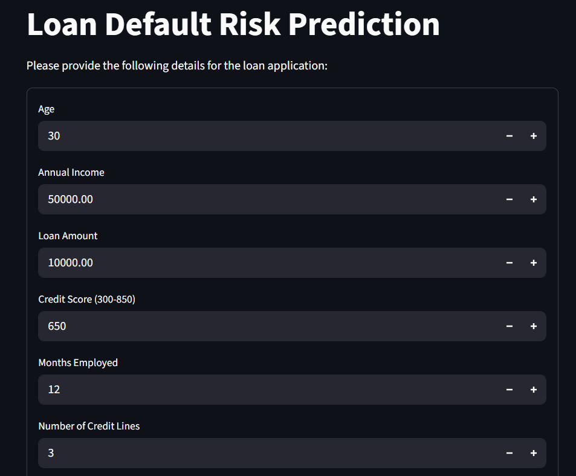

# 🚀 Loan Default Prediction ML Model 💰

<div align="center">
  
  
  
  
  <br>
</div>

---

## 🚀 Deployment

[](https://loan-default-prediction-ml-model.streamlit.app)

[](https://loan-default-prediction-ml-model.streamlit.app)


## 🎯 Overview

Welcome to the **Loan Default Prediction ML Model**! 🎉 This cutting-edge machine learning project predicts the risk of loan default using advanced algorithms and a comprehensive dataset. Built with ❤️ using Python, Streamlit, and state-of-the-art ML libraries.

### 🌟 Key Highlights
- 🎯 **High Accuracy**: Multiple ML models with optimized performance
- 🚀 **Real-time Prediction**: Interactive web app for instant results
- 📊 **Comprehensive Analysis**: Deep insights into loan risk factors
- 🎨 **Beautiful UI**: Modern, user-friendly Streamlit interface
- 📈 **Data Visualization**: Rich analytics and model performance metrics

---

## 🔥 Features

### ✨ Core Functionality
- 🔮 **Risk Assessment**: Predict loan default probability with confidence scores
- 📝 **User-Friendly Form**: Intuitive input interface for loan details
- 🎛️ **Multiple Models**: XGBoost, Random Forest, Decision Tree, Logistic Regression
- 📊 **Feature Engineering**: Advanced preprocessing and feature creation
- 💾 **Model Persistence**: Pre-trained models ready for deployment

### 🎨 Interface Features
- 🌙 **Responsive Design**: Works seamlessly on all devices
- 🎯 **Real-time Feedback**: Instant prediction results with visual indicators
- 📱 **Mobile Optimized**: Perfect experience on smartphones and tablets
- 🎪 **Interactive Elements**: Dynamic forms and engaging user experience

---

## 🛠️ Tech Stack

<div align="center">

| Category | Technologies |
|----------|-------------|
| **Programming** |  |
| **ML Frameworks** |   |
| **Web Framework** |  |
| **Data Processing** |   |
| **Visualization** |   |

</div>

---

## 📊 Dataset Overview

### 📋 Features Used
- 👤 **Demographics**: Age, Education, Marital Status, Employment Type
- 💼 **Financial**: Income, Credit Score, Months Employed, Number of Credit Lines
- 🏠 **Loan Details**: Loan Amount, Interest Rate, Loan Term, DTI Ratio
- 🏡 **Property**: Has Mortgage, Has Dependents
- 🎯 **Purpose**: Loan Purpose, Has Co-Signer

### 📈 Dataset Statistics
- 📊 **Total Records**: 255,347 loan applications
- 🎯 **Features**: 17 comprehensive features
- ⚖️ **Target Balance**: Balanced default/non-default distribution
- 🔍 **Data Quality**: Clean, preprocessed dataset ready for ML

---

## 🤖 Machine Learning Models

<div align="center">

| Model | Accuracy | Use Case |
|-------|----------|----------|
| 🚀 **XGBoost** | ⭐⭐⭐⭐⭐ | Primary model for production |
| 🌲 **Random Forest** | ⭐⭐⭐⭐ | Ensemble learning approach |
| 🌳 **Decision Tree** | ⭐⭐⭐ | Interpretable baseline model |
| 📈 **Logistic Regression** | ⭐⭐⭐ | Linear baseline model |

</div>

### 🎯 Model Performance
- 🎪 **Precision**: High precision for default prediction
- 🎨 **Recall**: Optimized for capturing risky loans
- 📊 **F1-Score**: Balanced performance metric
- 🚀 **AUC-ROC**: Excellent discrimination ability

---

## 🚀 Quick Start

### 📋 Prerequisites
- 🐍 Python 3.8+
- 📦 pip package manager
- 💻 Git (optional)

### ⚡ Installation

```bash
# Clone the repository
git clone https://github.com/shubhamaher8/Loan-Default-ML-Model.git
cd Loan-Default-ML-Model

# Install dependencies
pip install -r requirements.txt
```

### 🎮 Usage

```bash
# Run the Streamlit app
streamlit run app.py
```

Then open your browser to `http://localhost:8501` and start predicting! 🎉

---

## 📱 Screenshots & Demo

  

---

## 🎯 How It Works

1. 📝 **Input Collection**: User provides loan application details
2. 🔧 **Preprocessing**: Data cleaning, encoding, and feature engineering
3. 🤖 **Prediction**: ML model analyzes risk factors
4. 📊 **Results**: Real-time prediction with confidence scores


---

## 📄 License

This project is licensed under the MIT License and is free to use by anyone


